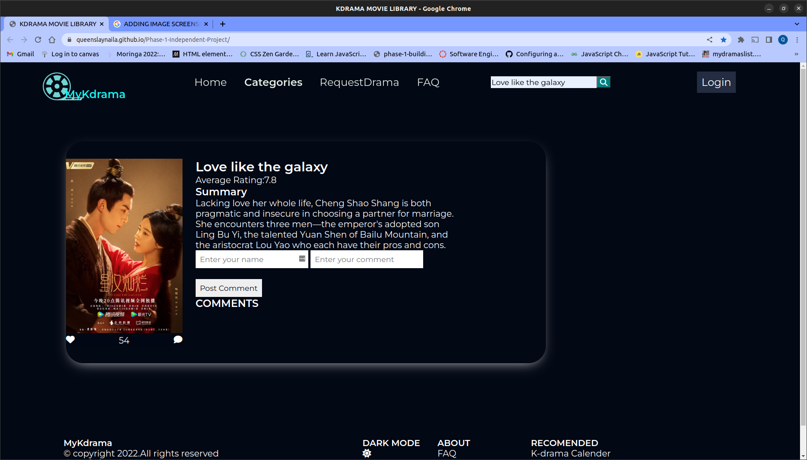

# Phase-1-Independent-Project

## PROJECT NAME

MyKdramaApp

## Table of Contents

1. [Description](#description)
2. [Technologies used](#technology-used)
3. [Setup](#setup)
4. [How to use the website](#how-to-use-the-website)
5. [Licence](#licence)
6. [Author info](#author-info)

## DESCRIPTION

This project is a movie library where users may login to view details about their favorite Asian movies like cast,summary,ratings on different sites.Users can then like and comment on their favorit movies

## TECHNOLOGY USED

    Project is created with:
            -HTML
            -CSS
            -Javascript
            -Google fonts
            -JSON

## SETUP

To run this projcet,clone this repository fom github.

## HOW TO USE THE WEBSITE

On page load the user will see different categories of movies filtered according to specific conditions.
The user can click the likebuttton on any movie card to like the specifc movie

To search a movie the user can type out its name in the search box.eg On search love like the galaxy a movie card containing details on the movie is displayed

## LICENCE

[MIT](LICENCE)
Copyright (c) 2022 Jema Queenslay Naila

## AUTHOR INFO

For any query contact me at queenslayjema@gmail.com.
